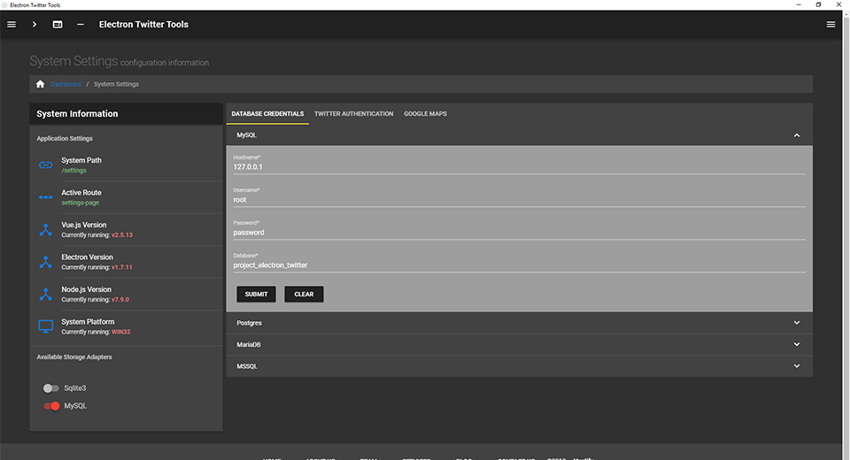

# Screen Shots

## The Search Page  

The Search Analytics Session screen features a litany of data including realtime visualizations, user geographic locations, sentiment analysis and much more.

## Lookup Users Screen

The Lookup Users main feature is the ability to search multiple users in a single go. The results are logically organized and visually stunning.

## System Settings Screen

This is the default system settings screen. Here you can configure your storage adapter, supply Twitter and Google maps keys and review core system information.
